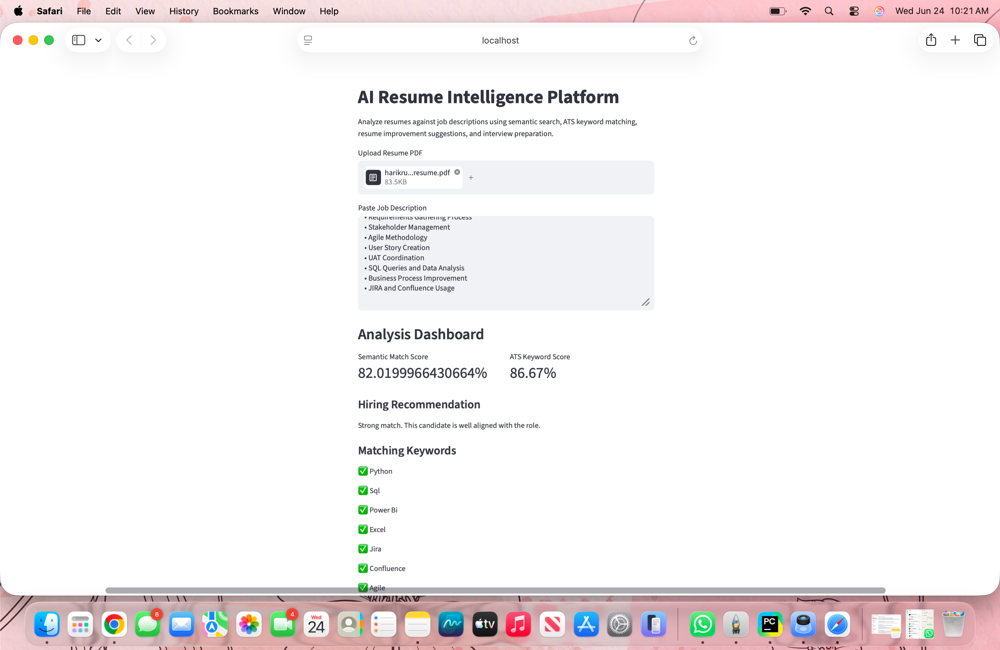
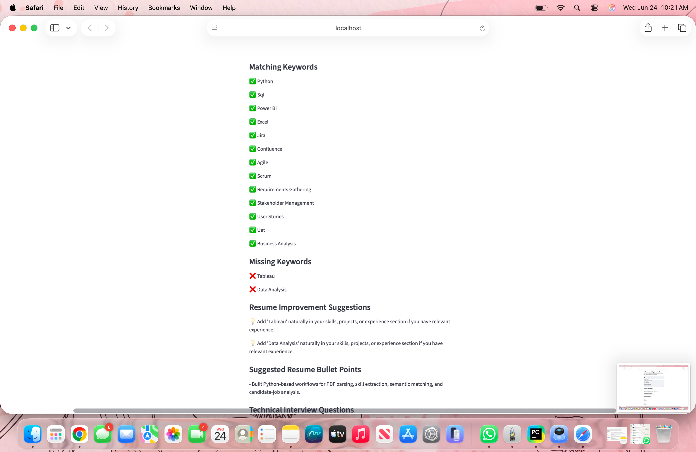
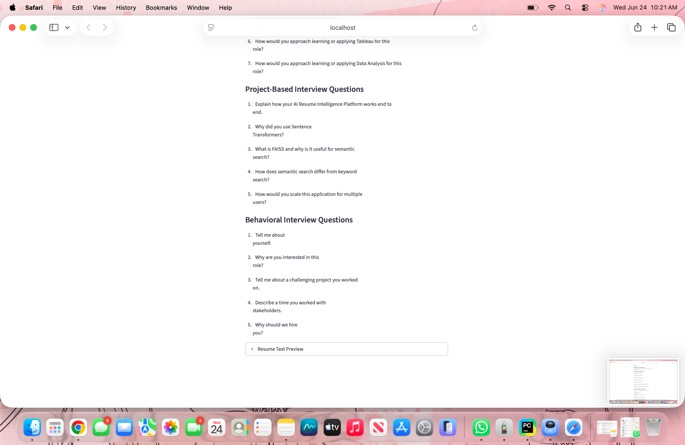

# AI Resume Intelligence Platform

## Live Demo

https://resume-intelligence-platform.streamlit.app

## GitHub Repository
https://github.com/ramu0102/AI-based-resume-screening-system
---

## Overview

AI Resume Intelligence Platform is an AI-powered application that analyzes resumes against job descriptions using semantic search and ATS keyword matching.

The platform helps candidates understand how well their resume aligns with a target role by generating semantic match scores, ATS keyword scores, missing skill analysis, resume improvement suggestions, and interview preparation questions.

This project demonstrates practical applications of Natural Language Processing (NLP), Sentence Transformers, semantic similarity search, and AI-driven recommendation systems.

---

## Features

### Resume Analysis

* Upload resume PDF files
* Extract resume text automatically
* Process and analyze candidate information

### Semantic Matching

* Generate embeddings using Sentence Transformers
* Compare resumes with job descriptions
* Calculate semantic similarity scores

### ATS Keyword Analysis

* Extract keywords from job descriptions
* Identify matching keywords
* Detect missing skills and technologies
* Generate ATS keyword score

### Resume Optimization

* Resume improvement recommendations
* Missing keyword suggestions
* Resume bullet point generation

### Interview Preparation

* Technical interview questions
* Project-based interview questions
* Behavioral interview questions

### Candidate Evaluation

* Hiring recommendations
* Resume-job fit assessment
* Candidate readiness insights

---

## Technology Stack

### Programming Language

* Python

### Frontend

* Streamlit

### AI & Machine Learning

* Sentence Transformers
* Semantic Search
* NLP Techniques

### Data Processing

* PyPDF
* Scikit-learn

### Vector Search

* FAISS

### Version Control

* Git
* GitHub

### Deployment

* Streamlit Community Cloud

---

## System Architecture

1. User uploads a resume PDF
2. User pastes a target job description
3. Resume text is extracted from PDF
4. Job description is processed
5. Sentence Transformer generates embeddings
6. Semantic similarity score is calculated
7. ATS keywords are extracted and compared
8. Missing skills are identified
9. Resume recommendations are generated
10. Interview questions are generated
11. Results are displayed through Streamlit dashboard

---

## Project Screenshots

### Homepage


### Analysis Dashboard



### Match Score & ATS Analysis



### Resume Improvement Suggestions


### Interview Preparation Dashboard



---

## Installation

Clone the repository:

```bash
git clone https://github.com/harikrupa-ai/ai-resume-intelligence-platform.git
cd ai-resume-intelligence-platform
```

Install dependencies:

```bash
pip install -r requirements.txt
```

Run the application:

```bash
streamlit run main.py
```

---

## Example Use Cases

* Resume screening
* Candidate-job matching
* ATS optimization
* Career coaching
* Interview preparation
* Recruitment support

---

## Skills Demonstrated

* Python Development
* NLP Applications
* Semantic Search
* Sentence Embeddings
* Vector Search Concepts
* Resume Intelligence Systems
* Streamlit Application Development
* AI Product Development
* Git & GitHub Workflow
* Cloud Deployment

---

## Future Enhancements

* Multi-resume comparison
* LLM-powered resume rewriting
* Resume ranking system
* Vector database integration
* Multi-job analysis
* Recruiter dashboard
* RAG-based candidate evaluation

---

## Author

Hari Krupa Cheguri

Master of Science in Business Analytics

AI Engineer | Machine Learning | Generative AI | NLP
